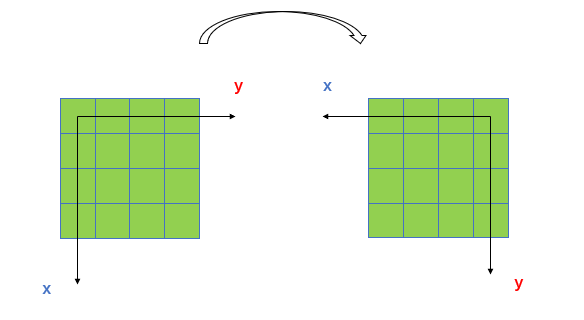
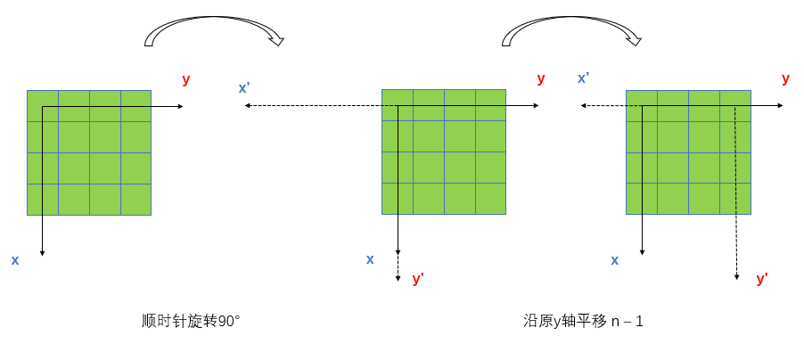

# 48. 旋转图像
给你一幅由 N × N 矩阵表示的图像，其中每个像素的大小为 4 字节。请你设计一种算法，将图像旋转 90 度。
要求空间复杂度O(1)

## 分析
通过找规律的方式能够得到旋转前后元素之间的映射关系，但是严格来说这是一道几何题，主要考察了**空间变换**的知识。

图像旋转的效果如图1所示

其旋转过程其实包括了两部分，第一步绕原点顺时针旋转``90°``，第二步沿原y轴右移``n - 1``

这两步的旋转矩阵可以写出来
$$
 \left[
 \begin{matrix}
    0 & 1 & 0 \\
    -1 & 0 & n - 1 \\
    0 & 0 & 1 \\
 \end{matrix}
 \right]
$$
## 代码